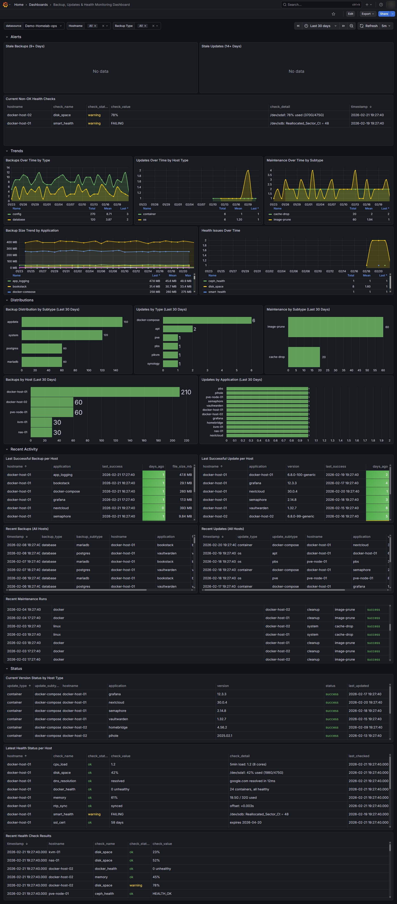

# Ansible Home Lab Automation

Ansible playbooks for home lab backup, verification, restore, health monitoring, updates, and
maintenance — orchestrated via [Semaphore](https://semaphoreui.com/), logged to MariaDB, and
visualized in Grafana.

> **Note:** This project was built for my own home lab. I've made it as portable as possible —
> deployment-specific values live in vault-encrypted vars files, and playbooks are
> platform-conditional — but it reflects the needs and topology of one particular setup. Use it
> as a working reference, adapt what fits, and skip what doesn't.

**Pick what you need.** This project is modular — use the playbooks that match your environment
and ignore the rest. You don't need every platform, every playbook, or even every component in
the stack.

## What it does

Covers the **full backup lifecycle** — create, verify, and restore — alongside health monitoring,
updates, and maintenance. Every operation logs to MariaDB with a Grafana dashboard for full
visibility.

| Category | What it does |
|---|---|
| **Backup** | Config/appdata archives and database dumps (Postgres + MariaDB), with offline rsync to NAS |
| **Verify** | Restores each database to a temp instance and validates config archives — proves backups work before you need them |
| **Restore** | Safety-gated database and appdata restore with pre-restore snapshots, selective per-app targeting, and coordinated cross-host recovery |
| **Rollback** | Revert Docker containers to previous image versions — fast local re-tag or registry pull; safety-gated with per-service targeting |
| **Health** | 26 scheduled checks — disk, memory, CPU, Docker, SSL, ZFS, BTRFS, SMART, NTP, DNS, plus platform-specific (Proxmox, Ceph, unRAID, PBS) — with Discord alerts and anomaly detection |
| **Updates** | OS package and Docker container updates with version tracking per host |
| **Maintenance** | Docker pruning, cache clearing, Semaphore task cleanup, service restarts |
| **Deploy** | Grafana dashboard + datasource deployment via API with automatic threshold syncing |

Every run logs a structured record to MariaDB. The included Grafana dashboard shows backup history,
version status per host, stale detection, health trends, and maintenance logs across 27 panels.

## Stack

| Component | Version | Purpose | Required? |
|---|---|---|---|
| **Ansible** | >= 2.14 | Automation engine | Yes |
| **Python** | >= 3.9 + PyMySQL | On controller (for `community.mysql`) | Yes |
| **MariaDB** | >= 10.5 | Logging database (`ansible_logging`) | Yes |
| **Semaphore** | any | Scheduling UI, credential management | No — [CLI works too](#running-without-semaphore) |
| **Grafana** | any | Dashboard (MySQL datasource) | No — data is in MariaDB regardless |
| **Discord** | — | Notifications (webhooks) | No — [silently skipped if not configured](#discord-notifications) |
| **Uptime Kuma** | any | Dead man's switch for health monitoring | No — [silently skipped if not configured](#uptime-kuma-dead-mans-switch) |

## Quick start

The fastest path to "does this work for me?" — one host, one playbook:

```bash
# 1. Clone and install dependencies
git clone <this-repo> && cd homelab-ops
ansible-galaxy collection install -r requirements.yaml

# 2. Set up vault
cp vars/secrets.yaml.example vars/secrets.yaml
ansible-vault encrypt vars/secrets.yaml    # set a password, then edit with your values

# 3. Create the database
mysql -u root -p < sql/init.sql

# 4. Set up inventory in Semaphore UI (or create a local reference copy)
cp inventory.example.yaml inventory.yaml  # local copy for CLI usage

# 5. Run a backup
ansible-playbook backup_hosts.yaml \
  -i inventory.yaml \
  -e hosts_variable=docker_stacks \
  -e config_file=docker_stacks \
  --vault-password-file ~/.vault_pass
```

Once that works, add more platforms by creating `vars/` files and inventory groups.

## Playbook matrix

Not every playbook applies to every homelab. Use this to identify what you need:

### Universal playbooks

These work with any Linux host. Create a vars file per platform, add hosts to inventory groups,
and go.

| Playbook | What it does | Vars file pattern |
|---|---|---|
| `backup_hosts.yaml` | Archive config/appdata directories, fetch to controller | `vars/<platform>.yaml` with `src_raw_files`, `backup_*` vars |
| `backup_databases.yaml` | Dump Postgres/MariaDB databases from Docker containers | `vars/db_<role>_<engine>.yaml` with `db_names`, `container_name` |
| `update_systems.yaml` | OS packages + Docker container updates with version tracking | `vars/<platform>.yaml` with `update_*` vars |
| `maintain_docker.yaml` | Prune unused Docker images | Needs `[docker]` group (children of `docker_stacks` + `docker_run`) |
| `maintain_semaphore.yaml` | Clean stopped Semaphore tasks + prune old logging data | Runs on localhost |
| `maintain_health.yaml` | 26 health checks across all SSH hosts + DB/API | `vars/semaphore_check.yaml` for thresholds |
| `verify_backups.yaml` | Verify DB backups (restore to temp DB) and config archives (integrity + staging) | Same `vars/` files as backup playbooks |
| `restore_databases.yaml` | Restore database dumps — single-DB or all; safety-gated with `confirm_restore=yes` | `vars/db_<role>_<engine>.yaml` with `db_container_deps` |
| `restore_hosts.yaml` | Restore config/appdata — staging or inplace; selective app + coordinated cross-host DB | `vars/<platform>.yaml` with `app_restore` mapping |
| `rollback_docker.yaml` | Revert Docker containers to previous images; safety-gated with `confirm_rollback=yes` | `vars/docker_stacks.yaml` (snapshot from `update_systems.yaml`) |

### Platform-specific playbooks

Skip these entirely if you don't have the hardware. No changes needed elsewhere.

| Playbook | Platform | What it does |
|---|---|---|
| `maintain_amp.yaml` | [AMP](https://cubecoders.com/AMP) game server | Version checks, journal pruning, dump cleanup |
| `maintain_unifi.yaml` | Unifi Network (UDMP) | Service restart |
| `maintain_cache.yaml` | Ubuntu / Debian | Drop Linux page cache |
| `backup_offline.yaml` | NAS-to-NAS (unRAID + Synology) | WOL, rsync, shutdown verification |
| `download_videos.yaml` | [MeTube](https://github.com/alexta69/metube) / yt-dlp | Automated video downloads with Discord notifications |
| `add_ansible_user.yaml` | PVE / PBS / unRAID | One-time setup: create ansible user with SSH key |
| `deploy_grafana.yaml` | Grafana (any host) | Deploy dashboard + datasource via API; syncs thresholds from Ansible vars |

### Health checks by platform

`maintain_health.yaml` runs checks conditionally based on inventory group membership. Checks
for platforms you don't have are automatically skipped.

| Check | Runs on | What it checks |
|---|---|---|
| `disk_space` | All SSH hosts | Filesystem usage (warning/critical thresholds) |
| `memory` | All SSH hosts | RAM usage percentage |
| `cpu_load` | All SSH hosts | 5-minute load average vs. vCPU count |
| `journal_errors` | All SSH hosts | Systemd journal errors since last check |
| `oom_kills` | All SSH hosts | Out-of-memory kills in dmesg |
| `docker_health` | All SSH hosts | Unhealthy Docker containers |
| `smart_health` | All SSH hosts | SMART disk status (auto-installs `smartmontools`) |
| `ssl_cert` | All SSH hosts | Let's Encrypt certificate expiry |
| `zfs_pool` | All SSH hosts | ZFS pool health (skips if no ZFS) |
| `btrfs_health` | All SSH hosts | BTRFS device error counters (skips if no BTRFS) |
| `ntp_sync` | All SSH hosts | Time synchronization status |
| `dns_resolution` | All SSH hosts | DNS resolver working |
| `docker_http` | Configured hosts | HTTP endpoint checks for Docker containers |
| `pve_cluster` | `[pve]` only | Proxmox cluster quorum |
| `ceph_health` | `[pve]` only | Ceph cluster status |
| `unraid_array` | `[unraid]` only | Array state + disabled/missing disks |
| `pbs_datastore` | `[pbs]` only | PBS datastore accessibility |
| `semaphore_tasks` | localhost | Failed Semaphore tasks since last check |
| `stale_backup` | localhost | Hosts with no backup in 9+ days |
| `backup_size_anomaly` | localhost | Backups significantly smaller than 30-day average |
| `failed_maintenance` | localhost | Failed maintenance runs since last check |
| `stale_maintenance` | localhost | Hosts with no maintenance in 3+ days |
| `mariadb_health` | localhost | Connection count + crashed tables |
| `wan_connectivity` | localhost | Outbound internet check |
| `appliance_reachable` | localhost | TCP connectivity to network appliances (PiKVM, UDMP, UNVR) |
| `host_reachable` | Aggregated | Detects hosts unreachable during SSH checks |

## What's in this repo

```
├── group_vars/
│   └── all.yaml                  # Shared defaults (remote_tmp, python interpreter)
├── vars/
│   ├── secrets.yaml             # Vault-encrypted secrets (not committed unencrypted)
│   ├── secrets.yaml.example      # Template — copy and fill in your values
│   ├── example.yaml              # Template — copy for new platform vars files
│   ├── semaphore_check.yaml      # Health thresholds, controller config, retention
│   └── <platform>.yaml           # One per platform (proxmox, docker_stacks, etc.)
├── tasks/                       # Shared task files (Discord, DB logging, assertions)
├── sql/
│   └── init.sql                 # Database schema — run once to create all tables
├── grafana/
│   └── grafana.json             # Grafana dashboard (deployed via deploy_grafana.yaml or manual import)
├── files/
│   ├── get_push_epoch.sh       # Helper script for Docker image age checks
│   ├── grafana.png             # Grafana dashboard screenshot
│   └── alert_*.svg             # Discord notification mockups for README
├── templates/
│   └── metube.conf.j2           # yt-dlp config template (download_videos only)
├── backup_*.yaml                # Backup playbooks
├── verify_backups.yaml          # On-demand backup verification (DB + config)
├── restore_databases.yaml       # Database restore from backups (safety-gated)
├── restore_hosts.yaml           # Config/appdata restore — staging or inplace
├── rollback_docker.yaml         # Docker container rollback — revert to previous versions (safety-gated)
├── update_*.yaml                # Update playbook (saves rollback snapshot before Docker updates)
├── maintain_*.yaml              # Maintenance + health playbooks
├── download_videos.yaml         # MeTube/yt-dlp automation
├── deploy_grafana.yaml          # Grafana dashboard + datasource deploy via API
├── add_ansible_user.yaml        # One-time user setup utility
├── requirements.yaml            # Ansible Galaxy collection dependencies
├── inventory.example.yaml       # Example inventory with expected group structure
├── DESIGN.md                    # Full architecture, patterns, and design decisions
└── CONTRIBUTING.md              # Contribution guide
```

Inventory is **not** stored here — it lives in Semaphore's UI/database. A local
`inventory.yaml` copy exists for convenience but is not version-controlled. See
[`inventory.example.yaml`](inventory.example.yaml) for the expected group structure.

## Setup

### 1. Database

```bash
mysql -u root -p < sql/init.sql
```

This creates the `ansible_logging` database with all six tables. See
[DESIGN.md](DESIGN.md#database-ansible_logging) for schema details.

### 2. Vault (secrets)

```bash
cp vars/secrets.yaml.example vars/secrets.yaml
# Edit the file with your values, then encrypt:
ansible-vault encrypt vars/secrets.yaml
```

See [`vars/secrets.yaml.example`](vars/secrets.yaml.example) for all available keys. Only the
`logging_db_*` and `logging_domain_*` keys are required by every playbook. Discord and Semaphore
API keys are optional — features degrade gracefully without them.

### 3. Inventory

Inventory lives in **Semaphore's UI/database** — each inventory groups hosts by authentication
method. A local `inventory.yaml` is kept for ease of viewing but is not the source of truth.

```bash
cp inventory.example.yaml inventory.yaml  # local reference copy only
```

The key concept: **functional groups** (`[ubuntu]`, `[pve]`, `[docker_stacks]`, etc.) determine
which playbook logic applies. A host can belong to multiple groups.

### 4. Platform vars files

Each platform needs a `vars/<name>.yaml` file defining backup paths, display names, and
categories. Copy [`vars/example.yaml`](vars/example.yaml) as a starting point:

```bash
cp vars/example.yaml vars/myplatform.yaml
```

The included vars files cover: Proxmox, PiKVM, Unifi, AMP, Docker (compose + run), Ubuntu,
unRAID, Synology, and database backups. Use or replace them as needed.

### 5. Semaphore (optional)

If using Semaphore for scheduling and credential management:

1. Add this repo in Semaphore
2. Create inventories organized by **authentication method** (SSH key, password, etc.)
3. Create variable groups with `hosts_variable` (and `config_file` when it differs)
4. Create templates pointing to the playbooks

See [DESIGN.md](DESIGN.md#semaphore-setup) for the full Semaphore configuration reference.

### 6. Grafana (optional)

`deploy_grafana.yaml` automates the full Grafana setup — it creates the `Ansible-Logging` MySQL
datasource (if missing) and imports the dashboard via API. It also syncs threshold values from
Ansible vars into the dashboard panels, so changing `health_backup_stale_hours` in
`vars/semaphore_check.yaml` automatically updates the Grafana Stale Backups panel on next deploy.

```bash
# One-time: create a Grafana service account (Editor role), add to vault:
ansible-vault edit vars/secrets.yaml
# Add: grafana_url, grafana_service_account_token

# Deploy dashboard + datasource
ansible-playbook deploy_grafana.yaml --vault-password-file ~/.vault_pass

# Dry run (no API calls)
ansible-playbook deploy_grafana.yaml --vault-password-file ~/.vault_pass --check
```

The dashboard includes 21 panels across 5 collapsible row groups (Alerts, Trends, Distributions,
Recent Activity, Status). Manual import via **Dashboards → Import → Upload JSON file** also works.

<details>
<summary>Dashboard screenshot</summary>



</details>

## Running without Semaphore

Every playbook can be run directly with `ansible-playbook`. Pass `hosts_variable` and
`config_file` as extra vars — these are normally set by Semaphore's variable groups:

```bash
# Backup Docker Compose hosts
ansible-playbook backup_hosts.yaml \
  -i inventory.yaml \
  -e hosts_variable=docker_stacks \
  -e config_file=docker_stacks \
  --vault-password-file ~/.vault_pass

# Backup Postgres databases from Docker containers
ansible-playbook backup_databases.yaml \
  -i inventory.yaml \
  -e hosts_variable=db_primary_postgres \
  -e config_file=db_primary_postgres \
  --vault-password-file ~/.vault_pass

# Update Ubuntu hosts
ansible-playbook update_systems.yaml \
  -i inventory.yaml \
  -e hosts_variable=ubuntu \
  -e config_file=ubuntu_os \
  --vault-password-file ~/.vault_pass

# Run health checks
ansible-playbook maintain_health.yaml \
  -i inventory.yaml \
  --vault-password-file ~/.vault_pass

# Verify database backups (restore to temp DB, count tables, drop)
ansible-playbook verify_backups.yaml \
  -i inventory.yaml \
  -e hosts_variable=db_primary_postgres \
  -e config_file=db_primary_postgres \
  --vault-password-file ~/.vault_pass

# Restore a single database (requires confirm_restore=yes safety gate)
ansible-playbook restore_databases.yaml \
  -i inventory.yaml \
  -e hosts_variable=db_primary_mariadb \
  -e config_file=db_primary_mariadb \
  -e confirm_restore=yes \
  -e restore_db=nextcloud \
  --vault-password-file ~/.vault_pass

# Stage a full backup for inspection (default safe mode — no changes to running services)
ansible-playbook restore_hosts.yaml \
  -i inventory.yaml \
  -e hosts_variable=docker_stacks \
  --limit myhost \
  --vault-password-file ~/.vault_pass

# In-place restore of one app's appdata (safety-gated, stops/starts container)
ansible-playbook restore_hosts.yaml \
  -i inventory.yaml \
  -e hosts_variable=docker_stacks \
  -e restore_app=sonarr \
  -e restore_mode=inplace \
  -e confirm_restore=yes \
  -e manage_docker=yes \
  --limit myhost \
  --vault-password-file ~/.vault_pass

# Coordinated restore — appdata + databases together (cross-host via delegate_to)
ansible-playbook restore_hosts.yaml \
  -i inventory.yaml \
  -e hosts_variable=docker_stacks \
  -e restore_app=sonarr \
  -e include_databases=yes \
  -e restore_mode=inplace \
  -e confirm_restore=yes \
  -e manage_docker=yes \
  --limit myhost \
  --vault-password-file ~/.vault_pass

# Rollback all Docker containers to pre-update snapshot (requires confirm_rollback=yes)
ansible-playbook rollback_docker.yaml \
  -i inventory.yaml \
  -e hosts_variable=docker_stacks \
  -e confirm_rollback=yes \
  --limit myhost \
  --vault-password-file ~/.vault_pass

# Rollback a single service
ansible-playbook rollback_docker.yaml \
  -i inventory.yaml \
  -e hosts_variable=docker_stacks \
  -e rollback_service=jellyseerr \
  -e confirm_rollback=yes \
  --limit myhost \
  --vault-password-file ~/.vault_pass

# Dry-run any playbook (no changes, no notifications, no DB writes)
ansible-playbook maintain_health.yaml \
  -i inventory.yaml \
  --vault-password-file ~/.vault_pass \
  --check
```

When `config_file` matches `hosts_variable` (e.g., both are `docker_stacks`), you can omit
`config_file` — it defaults to `hosts_variable`.

## Discord notifications

Discord is **optional**. If `discord_webhook_id` and `discord_webhook_token` are not defined in
the vault, all Discord notification tasks are silently skipped. No errors, no changes needed to
playbooks.

To enable: create a webhook in your Discord server (Server Settings > Integrations > Webhooks),
extract the ID and token from the URL, and add them to your vault.

<details>
<summary>Notification examples</summary>
<br>
<table>
<tr>
<td></td>
<td></td>
</tr>
<tr>
<td></td>
<td></td>
</tr>
</table>
</details>

## Uptime Kuma dead man's switch

Uptime Kuma is **optional**. If `uptime_kuma_push_url` is not defined in the vault, the heartbeat
task is silently skipped.

`maintain_health.yaml` sends a push heartbeat to Uptime Kuma at the end of every successful run.
If the playbook crashes, hangs, or the Semaphore scheduler stops running, Uptime Kuma detects the
missing heartbeat and alerts independently of Discord and Grafana.

To enable:

1. Create a **Push** monitor in Uptime Kuma
2. Set the heartbeat interval to match your `maintain_health.yaml` schedule (e.g., every 1 hour)
3. Copy the push URL into your vault:
   ```bash
   ansible-vault edit vars/secrets.yaml
   # Add: uptime_kuma_push_url: "https://uptime.example.com/api/push/xxxx"
   ```

See [DESIGN.md](DESIGN.md#triple-alerting-discord-push--grafana-pull--uptime-kuma-dead-mans-switch)
for how Uptime Kuma fits into the triple alerting architecture.

## Adding a new platform

To add a platform that isn't already covered (e.g., TrueNAS, Home Assistant, OPNsense):

1. **Inventory** — add hosts to the appropriate Semaphore inventory under a new group (e.g., `[truenas]`)
2. **Vars file** — copy `vars/example.yaml` to `vars/truenas.yaml`, fill in backup paths and names
3. **Semaphore** (if using) — create a variable group: `{"hosts_variable": "truenas"}`
4. **Update playbook** — if the platform has a version command, add one line to the
   `_os_version_commands` dict in `update_systems.yaml`:
   ```yaml
   _os_version_commands:
     truenas: "midclt call system.version"
   ```
5. **Health checks** — platform-specific checks (like `unraid_array` or `pve_cluster`) need new
   tasks in `maintain_health.yaml` with `when: "'truenas' in group_names"`. Universal checks
   (disk, memory, Docker, etc.) work automatically.

No database changes are needed — Ansible sends all column values at INSERT time.

## Configuration reference

| File | Purpose |
|---|---|
| `vars/secrets.yaml.example` | All vault keys with descriptions |
| `vars/example.yaml` | All vars file keys with descriptions |
| `vars/semaphore_check.yaml` | Health check thresholds (all tunable) |
| `inventory.example.yaml` | Expected inventory group structure |
| [DESIGN.md](DESIGN.md) | Full architecture, patterns, database schema, and design decisions |

## License

MIT — see [LICENSE](LICENSE)
