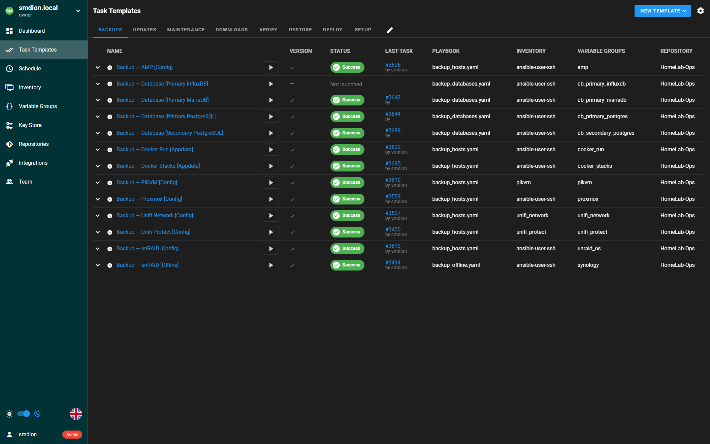

# Ansible Home Lab Automation

Ansible playbooks for home lab backup, verification, restore, health monitoring, updates,
maintenance, deployment, and provisioning — orchestrated via
[Semaphore](https://semaphoreui.com/), logged to MariaDB, alerted via Discord or Apprise, and visualized in Grafana.

> **Note:** This project was built for my own home lab. I've made it as portable as possible —
> deployment-specific values live in vault-encrypted vars files, and playbooks are
> platform-conditional — but it reflects the needs and topology of one particular setup. Use it
> as a working reference, adapt what fits, and skip what doesn't.

**Pick what you need.** This project is modular — use the playbooks that match your environment
and ignore the rest. You don't need every platform, every playbook, or even every component in
the stack.

## What it does

Covers the **full backup lifecycle** — create, verify, and restore — alongside health monitoring,
updates, and maintenance. Every operation logs to MariaDB with a Grafana dashboard for full
visibility.

| Category | What it does |
|---|---|
| **Backup** | Config/appdata archives and database dumps (Postgres, MariaDB, InfluxDB), with offline rsync to NAS and offsite sync to Backblaze B2 |
| **Verify** | Restores each database to a temp instance and validates config archives — proves backups work before you need them |
| **Restore** | Safety-gated database and appdata restore with pre-restore snapshots, selective per-app targeting, and coordinated cross-host recovery |
| **Rollback** | Revert Docker containers to previous image versions — fast local re-tag or registry pull; safety-gated with per-service targeting |
| **Health** | 26 scheduled checks — disk, memory, CPU, Docker, SSL, ZFS, BTRFS, SMART, NTP, DNS, plus platform-specific (Proxmox, Ceph, unRAID, PBS) — with Discord/Apprise alerts and anomaly detection |
| **Updates** | OS package and Docker container updates with version tracking, optional delay, and per-container exclusions |
| **Maintenance** | Docker pruning, cache clearing, Semaphore task cleanup, service restarts |
| **Deploy** | Docker stacks from Git — templates `.env` from vault, copies compose files, validates, and starts stacks in dependency order; Grafana dashboard + datasource via API with automatic threshold syncing |
| **Build** | Provision Ubuntu VMs on Proxmox via API — cloud-init, Docker install, SSH hardening, UFW firewall; create, destroy, snapshot, or revert |
| **Apply Role** | Idempotent VM reconciliation — make a VM match its `vm_definitions` spec across OS, network, Docker, stacks, and verification layers; all-roles or single-role targeting |
| **DR Rebuild** | Disaster recovery rebuild — provision VM → bootstrap → restore backups → deploy stacks → health check; sequential multi-role via `scripts/dr_rebuild_all.sh` |
| **Test Restore** | End-to-end DR simulation on a disposable Proxmox VM — restores a source host's full appdata, deploys all stacks, verifies container health, reverts to clean state; `dr_mode=yes` keeps the restored state for real DR recovery |
| **Test Backup Restore** | Per-app backup integrity test on a disposable VM — deploys stacks fresh, then for each app: stops the stack, restores DB + appdata from the backup archive, restarts, and asserts HTTP health; OOM auto-recovery doubles VM RAM and retries |

Every run logs a structured record to MariaDB. The included Grafana dashboard shows backup history,
version status per host, stale detection, health trends, and maintenance logs across 28 panels.

## Stack

| Component | Version | Purpose | Required? |
|---|---|---|---|
| **Ansible** | >= 2.14 | Automation engine | Yes |
| **Python** | >= 3.9 + [requirements.txt](requirements.txt) | On controller (PyMySQL, proxmoxer) | Yes |
| **MariaDB** | >= 10.5 | Logging database (`ansible_logging`) | Yes |
| **Semaphore** | any | Scheduling UI, credential management | No — [CLI works too](#running-without-semaphore) |
| **Grafana** | any | Dashboard (MySQL datasource) | No — data is in MariaDB regardless |
| **Discord** | — | Notifications (webhooks) | No — [silently skipped if not configured](#notifications) |
| **Apprise** | any | 60+ notification services (Telegram, ntfy, Gotify, Pushover, Slack, etc.) — CLI or self-hosted API | No — [silently skipped if not configured](#notifications) |
| **Uptime Kuma** | any | Dead man's switch for health monitoring | No — [silently skipped if not configured](#uptime-kuma-dead-mans-switch) |

## Quick start

The fastest path to "does this work for me?" — one host, one playbook:

```bash
# 1. Clone and install dependencies
git clone <this-repo> && cd homelab-ops
pip install -r requirements.txt
ansible-galaxy collection install -r requirements.yaml

# 2. Set up vault
cp vars/secrets.yaml.example vars/secrets.yaml
ansible-vault encrypt vars/secrets.yaml    # set a password, then edit with your values

# 3. Create the database
mysql -u root -p < sql/init.sql

# 4. Set up inventory in Semaphore UI (or create a local reference copy)
cp inventory.example.yaml inventory.yaml  # local copy for CLI usage

# 5. Run a backup
ansible-playbook backup_hosts.yaml \
  -i inventory.yaml \
  -e hosts_variable=docker_stacks \
  -e config_file=docker_stacks \
  --vault-password-file ~/.vault_pass
```

Once that works, add more platforms by creating `vars/` files and inventory groups.

## Playbook matrix

Not every playbook applies to every homelab. Use this to identify what you need:

### Universal playbooks

These work with any Linux host. Create a vars file per platform, add hosts to inventory groups,
and go.

| Playbook | What it does | Vars file pattern |
|---|---|---|
| `backup_hosts.yaml` | Archive config/appdata directories, fetch to controller; `docker_stacks` hosts use per-stack archives (stop → archive → restart each stack individually to minimize downtime); backup paths discovered from `homelab.backup.paths` container labels; auto-handles PiKVM RW/RO filesystem | `vars/<platform>.yaml` with `backup_*` vars |
| `backup_databases.yaml` | Dump Postgres/MariaDB/InfluxDB databases from Docker containers | `vars/db_<role>_<engine>.yaml` with `db_names`, `db_container_name` |
| `update_systems.yaml` | OS packages + Docker container updates with version tracking; supports `update_delay_days` and `update_exclude_services`/`update_exclude_containers` | `vars/<platform>.yaml` with `update_*` vars |
| `maintain_docker.yaml` | Prune unused Docker images + drop Linux page cache (Ubuntu/unRAID); logs disk metrics to MariaDB | Needs `[docker]` group + `[ubuntu]`/`[unraid]` for cache |
| `maintain_semaphore.yaml` | Clean stopped Semaphore tasks, prune old download tasks (`download_task_retention_days`), and prune `ansible_logging` rows (`retention_days`) | Runs on localhost |
| `maintain_logging_db.yaml` | Purge failed/warning records from `ansible_logging`; `-e purge_all=yes -e confirm=yes` truncates all tables (full reset after arch changes) | Runs on localhost |
| `check_logging_db.yaml` | Weekly `ansible_logging` summary — 7-day row counts per table, hosts with no recent backup, failure counts — sends an informational notification; logs to MariaDB | Runs on localhost |
| `maintain_health.yaml` | 26 health checks across all SSH hosts + DB/API | `vars/semaphore_check.yaml` for thresholds |
| `verify_backups.yaml` | Verify DB backups (restore to temp DB, count tables/measurements) and config archives (integrity + staging) | Same `vars/` files as backup playbooks |
| `restore_databases.yaml` | Restore database dumps — single-DB or all; safety-gated with `confirm=yes` | `vars/db_<role>_<engine>.yaml` with `db_container_deps` |
| `restore_hosts.yaml` | Restore config/appdata — per-stack, selective app, or monolithic; safety-gated with `confirm=yes`; coordinated cross-host DB (`with_databases=yes`); `stack=`/`role=` scope selectors | `vars/<platform>.yaml` + `vars/app_definitions.yaml` |
| `restore_amp.yaml` | Restore AMP game server instance(s) from backup; safety-gated with `confirm=yes`; pass `restore_target`; optionally `amp_instance_filter` for a single instance | `vars/amp.yaml` |
| `restore_app.yaml` | Restore a single app (appdata + all DBs) to a production host; safety-gated with `confirm=yes`; pass `restore_app`, `restore_target`, optionally `restore_source_host` | `vars/docker_stacks.yaml` `app_definitions` dict + runtime config from container labels |
| `rollback_docker.yaml` | Revert Docker containers to previous images; `with_backup=yes` for combined image+appdata+DB recovery; `stack=`/`role=` scope; safety-gated with `confirm=yes` | `vars/docker_stacks.yaml` (snapshot from `update_systems.yaml`) |
| `deploy_stacks.yaml` | Deploy Docker stacks from Git — template `.env` from vault, copy compose files, validate, start; dependency-ordered via `stack_assignments`; supports single-stack deploy; `role=`/`stack=` scope selectors; `serial: 1` for multi-host ordering | `vars/docker_stacks.yaml` with `stack_assignments` |
| `apply_role.yaml` | Idempotent VM reconciliation — make a VM match its definition across OS/network/Docker/stacks/verification layers; omit `-e role` for all Docker VMs (`serial: 1`, VMID order); `-e role=core` to target one; per-layer skip flags | `vars/vm_definitions.yaml` with consolidated VM spec |

### Platform-specific playbooks

Skip these entirely if you don't have the hardware. No changes needed elsewhere.

| Playbook | Platform | What it does |
|---|---|---|
| `maintain_amp.yaml` | [AMP](https://cubecoders.com/AMP) game server | Version checks, journal pruning, dump cleanup |
| `maintain_unifi.yaml` | Unifi Network (UDMP) | Service restart |
| `backup_offline.yaml` | NAS-to-NAS (unRAID + Synology) | Wake Synology via WOL, rsync backup data from unRAID to Synology, verify shutdown |
| `backup_offsite.yaml` | Backblaze B2 | Sync `/backup/` to B2 via restic or rclone; supports `dry_run=yes` and `bwlimit=` |
| `download_videos.yaml` | [MeTube](https://github.com/alexta69/metube) / yt-dlp | Automated video downloads with per-video notifications; supports multiple profiles (`download_default`, `download_on_demand`) |
| `setup_ansible_user.yaml` | PVE / PBS / unRAID | One-time setup: create ansible user with SSH key |
| `setup_pve_vip.yaml` | Proxmox | One-time VIP setup: install keepalived on PVE nodes, configure VRRP priorities, verify floating management VIP is reachable |
| `setup_test_network.yaml` | Unifi UDM | One-time test VLAN creation for VM isolation; prints zone policy settings for manual firewall step |
| `verify_isolation.yaml` | Proxmox + Unifi | Verify test VLAN isolation — provisions a bare VM, runs network checks (production blocked, internet allowed), destroys VM |
| `maintain_pve.yaml` | Proxmox + PBS | Idempotent PVE node config: keepalived VIP, ansible user, SSH hardening; VM snapshot staleness check (>14d alert); PBS backup task error check (last 2 days via `proxmox-backup-manager`); notification + MariaDB logging |
| `build_ubuntu.yaml` | Proxmox | Provision Ubuntu VMs via API — cloud-init, Docker install, SSH hardening, UFW, optional QEMU args (`pve_args`) and desktop env; supports create, destroy, snapshot, and revert |
| `dr_rebuild.yaml` | Proxmox + `docker_stacks` | DR rebuild — provision VM → bootstrap → restore backups → deploy stacks → health check; `-e role=core\|apps\|dev`; `scripts/dr_rebuild_all.sh` for multi-role sequential execution |
| `test_restore.yaml` | Proxmox + `docker_stacks` | End-to-end restore test on a disposable VM — provisions or reuses a VM, restores a source host's appdata, deploys stacks, patches SWAG configs, verifies health, reverts to snapshot; `vm_name` defaults to `test-vm`; `role` can substitute for `source_host`; DR mode (`dr_mode=yes`) keeps restored state |
| `test_backup_restore.yaml` | Proxmox + `docker_stacks` | Test all `app_definitions` apps on a disposable VM — per-app restore (DB + appdata from backup archives), per-stack health check, OOM auto-recovery (doubles VM memory + retries), notification summary, revert; pass `test_apps=` to limit scope |
| `deploy_grafana.yaml` | Grafana | Deploy dashboard + datasource via API; syncs thresholds from Ansible vars |

> **unRAID — Fix Common Problems:** If you have the [Fix Common Problems](https://forums.unraid.net/topic/47266-plugin-ca-fix-common-problems/) plugin installed, it will raise an alert when `setup_ansible_user.yaml` adds the `ansible` user via SSH. This is expected behaviour — the plugin flags any new SSH-capable user as a potential security concern. You can safely acknowledge and suppress the alert once you've verified the key and confirmed the user was added intentionally.

### Health checks by platform

`maintain_health.yaml` runs checks conditionally based on inventory group membership. Checks
for platforms you don't have are automatically skipped.

| Check | Runs on | What it checks |
|---|---|---|
| `disk_space` | All SSH hosts | Filesystem usage (warning/critical thresholds) |
| `memory` | All SSH hosts | RAM usage percentage |
| `cpu_load` | All SSH hosts | 5-minute load average vs. vCPU count |
| `journal_errors` | All SSH hosts | Systemd journal errors since last check |
| `oom_kills` | All SSH hosts | Out-of-memory kills in dmesg |
| `docker_health` | All SSH hosts | Unhealthy Docker containers |
| `smart_health` | All SSH hosts | SMART disk status (auto-installs `smartmontools`) |
| `ssl_cert` | All SSH hosts | Let's Encrypt certificate expiry |
| `zfs_pool` | All SSH hosts | ZFS pool health (skips if no ZFS) |
| `btrfs_health` | All SSH hosts | BTRFS device error counters (skips if no BTRFS) |
| `ntp_sync` | All SSH hosts | Time synchronization status |
| `dns_resolution` | All SSH hosts | DNS resolver working |
| `docker_http` | Configured hosts | HTTP endpoint checks for Docker containers |
| `pve_cluster` | `[pve]` only | Proxmox cluster quorum |
| `ceph_health` | `[pve]` only | Ceph cluster status |
| `unraid_array` | `[unraid]` only | Array state + disabled/missing disks |
| `pbs_datastore` | `[pbs]` only | PBS datastore accessibility |
| `semaphore_tasks` | localhost | Failed Semaphore tasks since last check |
| `stale_backup` | localhost | Hosts with no backup in 9+ days |
| `backup_size_anomaly` | localhost | Backups significantly smaller than 30-day average; exclude apps via `health_backup_size_exclude` in `vars/semaphore_check.yaml` |
| `failed_maintenance` | localhost | Failed maintenance runs since last check |
| `stale_maintenance` | localhost | Hosts with no maintenance in 3+ days |
| `mariadb_health` | localhost | Connection count + crashed tables |
| `wan_connectivity` | localhost | Outbound internet check |
| `appliance_reachable` | localhost | TCP connectivity to network appliances (PiKVM, UDMP, UNVR) |
| `host_reachable` | Aggregated | Detects hosts unreachable during SSH checks |

## What's in this repo

```
├── group_vars/
│   ├── all.yaml                  # Shared defaults (remote_tmp, python interpreter)
│   └── pikvm.yaml                # PiKVM group vars
├── vars/
│   ├── secrets.yaml              # Vault-encrypted secrets (not committed unencrypted)
│   ├── secrets.yaml.example      # Template — copy and fill in your values
│   ├── example.yaml              # Template — copy for new platform vars files
│   ├── semaphore_check.yaml      # Health thresholds, controller config, retention
│   ├── vm_definitions.yaml       # Consolidated VM specs (stacks, VIPs, deploy config)
│   ├── host_definitions.yaml     # Non-VM host definitions (VPS, unRAID, legacy Docker)
│   ├── pve_definitions.yaml      # PVE cluster node definitions (IPs, FQDNs)
│   ├── app_definitions.yaml      # Per-app metadata (DB mappings, health endpoints)
│   ├── docker_stacks.yaml        # Docker stack host config (backup paths, display names)
│   ├── docker_vips.yaml          # VIP-to-role mapping for keepalived
│   ├── guacamole.yaml            # Guacamole connection groups, SSH defaults, extra connections
│   └── <platform>.yaml           # One per platform (proxmox, amp, unraid_os, etc.)
├── tasks/                        # 51 shared task files — assertions, DB ops, backup/restore
│                                 #   orchestration, VM provisioning, Docker management, notifications
├── stacks/                       # Docker stack definitions
│   ├── apps/                     # Application services (Nextcloud, Jellyfin, etc.)
│   ├── auth/                     # Authentication (Authentik)
│   ├── databases/                # Database engines (MariaDB, Postgres)
│   ├── dev/                      # Development tools
│   ├── infra/                    # Infrastructure (SWAG, Semaphore, Apprise)
│   ├── media/                    # Media management (Sonarr, Radarr, etc.)
│   ├── monitoring/               # Monitoring (Grafana, Uptime Kuma)
│   └── vpn/                      # VPN services
├── templates/
│   ├── keepalived.conf.j2        # Keepalived VRRP config for VMs
│   ├── keepalived-docker.conf.j2 # Keepalived config for Docker VIP
│   ├── metube.conf.j2            # yt-dlp config (download_videos only)
│   └── netplan-loopback-aliases.j2 # Loopback alias netplan config
├── sql/
│   └── init.sql                  # Database schema — run once to create all 8 tables
├── grafana/
│   └── grafana.json              # Grafana dashboard (deployed via deploy_grafana.yaml)
├── files/
│   ├── get_push_epoch.sh         # Helper script for Docker image age checks
│   ├── grafana.png               # Grafana dashboard screenshot
│   ├── semaphore.png             # Semaphore Task Templates screenshot
│   └── alert_*.svg               # Discord notification mockups
├── scripts/
│   └── dr_rebuild_all.sh         # Shell wrapper for sequential multi-role DR rebuild
│
│── # ── Playbooks (31) ──────────────────────────────────────────────
├── backup_*.yaml                 # Backup: hosts, databases, offline NAS-to-NAS, offsite B2
├── verify_backups.yaml           # Backup verification (DB + config archives)
├── restore_databases.yaml        # Database restore (safety-gated)
├── restore_hosts.yaml            # Appdata restore — per-stack, selective, or monolithic (safety-gated)
├── restore_amp.yaml              # AMP instance restore (safety-gated)
├── restore_app.yaml              # Production single-app restore (safety-gated)
├── rollback_docker.yaml          # Docker rollback — revert images; with_backup=yes for combined recovery
├── update_systems.yaml           # OS + Docker updates with version tracking
├── maintain_*.yaml               # Maintenance: docker, health, semaphore, logging_db, pve, amp, unifi
├── check_logging_db.yaml         # Weekly ansible_logging summary — row counts, missing backups, failures
├── download_videos.yaml          # MeTube/yt-dlp automation
├── deploy_stacks.yaml            # Docker stack deploy from Git — .env templating, compose, validate, start
├── deploy_grafana.yaml           # Grafana dashboard + datasource deploy via API
├── apply_role.yaml               # Idempotent VM reconciliation — all layers or single role
├── dr_rebuild.yaml               # DR rebuild — provision → bootstrap → restore → deploy → health check
├── build_ubuntu.yaml             # Provision Ubuntu VMs on Proxmox
├── test_restore.yaml             # End-to-end restore test on a disposable VM
├── test_backup_restore.yaml      # Per-app backup integrity test on a disposable VM
├── verify_isolation.yaml         # Test VLAN isolation verification — provision, check, destroy
├── setup_ansible_user.yaml       # One-time ansible user setup (PVE/PBS/unRAID)
├── setup_pve_vip.yaml            # One-time keepalived VIP setup on PVE nodes
├── setup_test_network.yaml       # One-time test VLAN creation on Unifi UDM
│
│── # ── Config ──────────────────────────────────────────────────────
├── requirements.txt              # Python pip dependencies (PyMySQL, proxmoxer)
├── requirements.yaml             # Ansible Galaxy collection dependencies
├── inventory.example.yaml        # Example inventory with expected group structure
├── DESIGN.md                     # Full architecture, patterns, and design decisions
└── CONTRIBUTING.md               # Contribution guide
```

Inventory lives in Semaphore's UI/database. `inventory.yaml` is committed here,
vault-encrypted as a local reference copy. See
[`inventory.example.yaml`](inventory.example.yaml) for the expected group structure.

## Setup

### 1. Database

```bash
mysql -u root -p < sql/init.sql
```

This creates the `ansible_logging` database with all eight tables. See
[DESIGN.md](DESIGN.md#database-ansible_logging) for schema details.

### 2. Vault (secrets)

```bash
cp vars/secrets.yaml.example vars/secrets.yaml
# Edit the file with your values, then encrypt:
ansible-vault encrypt vars/secrets.yaml
```

See [`vars/secrets.yaml.example`](vars/secrets.yaml.example) for all available keys. Only the
`logging_db_*` and `domain_*` keys are required by every playbook. Discord, Apprise, and Semaphore
credentials are optional — features degrade gracefully without them.

### 3. Inventory

Inventory lives in **Semaphore's UI/database** — each inventory groups hosts by authentication
method. `inventory.yaml` is also committed here, vault-encrypted; decrypt it to view or edit.

```bash
ansible-vault view inventory.yaml        # view hosts/groups
ansible-vault edit inventory.yaml        # edit in place
cp inventory.example.yaml inventory.yaml # start fresh from example
```

The key concept: **functional groups** (`[ubuntu]`, `[pve]`, `[docker_stacks]`, etc.) determine
which playbook logic applies. A host can belong to multiple groups.

### 4. Platform vars files

Each platform needs a `vars/<name>.yaml` file defining backup paths, display names, and
categories. Copy [`vars/example.yaml`](vars/example.yaml) as a starting point:

```bash
cp vars/example.yaml vars/myplatform.yaml
```

The included vars files cover: Proxmox, PiKVM, Unifi, AMP, Docker (compose + run), Ubuntu,
unRAID, Synology, and database backups. Use or replace them as needed.

### 5. Semaphore (optional)

If using Semaphore for scheduling and credential management:

1. Add this repo in Semaphore
2. Create inventories organized by **authentication method** (SSH key, password, etc.)
3. Create variable groups with `hosts_variable` (and `config_file` when it differs)
4. Create templates pointing to the playbooks — templates are organized into **views**
   (Backups, Updates, Maintenance, Downloads, Verify, Restore, Deploy, Setup) for easy navigation

See [DESIGN.md](DESIGN.md#semaphore-setup) for the full Semaphore configuration reference.

<details>
<summary>Task Templates screenshot</summary>



</details>

### 6. Grafana (optional)

`deploy_grafana.yaml` automates the full Grafana setup — it creates the `Ansible-Logging` MySQL
datasource (if missing) and imports the dashboard via API. It also syncs threshold values from
Ansible vars into the dashboard panels, so changing `health_backup_stale_days` or
`health_update_stale_days` in `vars/semaphore_check.yaml` automatically updates the
corresponding Stale Backups and Stale Updates panels on next deploy.

```bash
# One-time: create a Grafana service account (Editor role), add to vault:
ansible-vault edit vars/secrets.yaml
# Add: grafana_url, grafana_service_account_token

# Deploy dashboard + datasource
ansible-playbook deploy_grafana.yaml --vault-password-file ~/.vault_pass

# Dry run (no API calls)
ansible-playbook deploy_grafana.yaml --vault-password-file ~/.vault_pass --check
```

The dashboard includes 25 panels across 5 collapsible row groups (Alerts, Trends, Distributions,
Recent Activity, Status). Manual import via **Dashboards → Import → Upload JSON file** also works.

<details>
<summary>Dashboard screenshot</summary>


</details>

## Running without Semaphore

Every playbook can be run directly with `ansible-playbook`. Pass `hosts_variable` and
`config_file` as extra vars — these are normally set by Semaphore's variable groups.

When `config_file` matches `hosts_variable` (e.g., both are `docker_stacks`), you can omit
`config_file` — it defaults to `hosts_variable`.

### Extra vars conventions

All user-facing `-e` vars follow a consistent naming and value pattern:

| Category | Pattern | Examples |
|---|---|---|
| **Routing** | `hosts_variable=<group>` | `hosts_variable=docker_stacks`, `hosts_variable=amp` |
| **Safety gate** | `confirm=yes` | Required for all destructive operations (restore, rollback) — never pre-set |
| **Opt-ins** | `with_*=yes` | `with_databases=yes` (coordinated DB restore), `with_backup=yes` (rollback + appdata + DB), `deploy_ssh_key=yes` |
| **Modes** | `*_mode=<value>` | `validate_only=yes`, `dr_mode=yes` |
| **Scope selectors** | `restore_*=`, `rollback_*=` | `restore_app=sonarr`, `restore_db=nextcloud`, `rollback_stack=vpn` |

**Value rule:** All boolean triggers use `=yes` — never `=true`. YAML booleans inside playbook code use `true`/`false` (different context). See [DESIGN.md](DESIGN.md#extra-vars-conventions) for the full reference.

<details>
<summary>Backup &amp; Updates</summary>

```bash
# Backup Docker Compose hosts
ansible-playbook backup_hosts.yaml \
  -i inventory.yaml \
  -e hosts_variable=docker_stacks \
  -e config_file=docker_stacks \
  --vault-password-file ~/.vault_pass

# Backup Postgres databases from Docker containers
ansible-playbook backup_databases.yaml \
  -i inventory.yaml \
  -e hosts_variable=db_primary_postgres \
  -e config_file=db_primary_postgres \
  --vault-password-file ~/.vault_pass

# Update Ubuntu hosts
ansible-playbook update_systems.yaml \
  -i inventory.yaml \
  -e hosts_variable=ubuntu \
  -e config_file=ubuntu_os \
  --vault-password-file ~/.vault_pass

# Backup AMP instances (all)
ansible-playbook backup_hosts.yaml \
  -i inventory.yaml \
  -e hosts_variable=amp \
  --vault-password-file ~/.vault_pass

# Backup a single AMP instance only
ansible-playbook backup_hosts.yaml \
  -i inventory.yaml \
  -e hosts_variable=amp \
  -e amp_instance_filter=Minecraft01 \
  --vault-password-file ~/.vault_pass

# Sync all backups to Backblaze B2
ansible-playbook backup_offsite.yaml \
  -i inventory.yaml \
  --vault-password-file ~/.vault_pass

# Dry run (preview only, no uploads)
ansible-playbook backup_offsite.yaml \
  -i inventory.yaml \
  -e dry_run=yes \
  --vault-password-file ~/.vault_pass

# Update AMP (all instances)
ansible-playbook update_systems.yaml \
  -i inventory.yaml \
  -e hosts_variable=amp \
  --vault-password-file ~/.vault_pass

# Update a single AMP instance only
ansible-playbook update_systems.yaml \
  -i inventory.yaml \
  -e hosts_variable=amp \
  -e amp_instance_filter=Minecraft01 \
  --vault-password-file ~/.vault_pass

# Run health checks
ansible-playbook maintain_health.yaml \
  -i inventory.yaml \
  --vault-password-file ~/.vault_pass
```
</details>

<details>
<summary>Verify</summary>

```bash
# Verify database backups (restore to temp DB, count tables/measurements, drop)
ansible-playbook verify_backups.yaml \
  -i inventory.yaml \
  -e hosts_variable=db_primary_postgres \
  -e config_file=db_primary_postgres \
  --vault-password-file ~/.vault_pass

# Verify config archives for Docker Compose hosts
ansible-playbook verify_backups.yaml \
  -i inventory.yaml \
  -e hosts_variable=docker_stacks \
  --vault-password-file ~/.vault_pass

# Verify AMP instance backup archives (all instances)
ansible-playbook verify_backups.yaml \
  -i inventory.yaml \
  -e hosts_variable=amp \
  --vault-password-file ~/.vault_pass

# Verify a single AMP instance only
ansible-playbook verify_backups.yaml \
  -i inventory.yaml \
  -e hosts_variable=amp \
  -e amp_instance_filter=Minecraft01 \
  --vault-password-file ~/.vault_pass
```
</details>

<details>
<summary>Restore &amp; Rollback</summary>

```bash
# Restore a single database (requires confirm=yes safety gate)
ansible-playbook restore_databases.yaml \
  -i inventory.yaml \
  -e hosts_variable=db_primary_mariadb \
  -e config_file=db_primary_mariadb \
  -e confirm=yes \
  -e restore_db=nextcloud \
  --vault-password-file ~/.vault_pass

# Restore a single stack's appdata (safety-gated — always stops/starts containers)
ansible-playbook restore_hosts.yaml \
  -i inventory.yaml \
  -e hosts_variable=docker_stacks \
  -e stack=auth \
  -e confirm=yes \
  --vault-password-file ~/.vault_pass

# Restore all stacks in a role
ansible-playbook restore_hosts.yaml \
  -i inventory.yaml \
  -e hosts_variable=docker_stacks \
  -e role=core \
  -e confirm=yes \
  --vault-password-file ~/.vault_pass

# Restore one app's appdata from monolithic archive
ansible-playbook restore_hosts.yaml \
  -i inventory.yaml \
  -e hosts_variable=docker_run \
  -e restore_app=sonarr \
  -e confirm=yes \
  --limit myhost \
  --vault-password-file ~/.vault_pass

# Coordinated restore — appdata + databases together (cross-host via delegate_to)
ansible-playbook restore_hosts.yaml \
  -i inventory.yaml \
  -e hosts_variable=docker_run \
  -e restore_app=sonarr \
  -e with_databases=yes \
  -e confirm=yes \
  --limit myhost \
  --vault-password-file ~/.vault_pass

# Rollback a single stack (image-only — fast, data untouched)
ansible-playbook rollback_docker.yaml \
  -i inventory.yaml \
  -e hosts_variable=docker_stacks \
  -e stack=auth \
  -e confirm=yes \
  --vault-password-file ~/.vault_pass

# Combined recovery — rollback images + restore appdata + auto-detected databases
ansible-playbook rollback_docker.yaml \
  -i inventory.yaml \
  -e hosts_variable=docker_stacks \
  -e stack=auth \
  -e with_backup=yes \
  -e confirm=yes \
  --vault-password-file ~/.vault_pass

# Rollback a single service
ansible-playbook rollback_docker.yaml \
  -i inventory.yaml \
  -e hosts_variable=docker_stacks \
  -e rollback_service=jellyseerr \
  -e confirm=yes \
  --limit myhost \
  --vault-password-file ~/.vault_pass
```
</details>

<details>
<summary>AMP Restore</summary>

```bash
# Restore all AMP instances from latest backups (safety-gated)
ansible-playbook restore_amp.yaml \
  -i inventory.yaml \
  -e restore_target=amp.home.local \
  -e confirm=yes \
  --vault-password-file ~/.vault_pass

# Restore a single instance only
ansible-playbook restore_amp.yaml \
  -i inventory.yaml \
  -e restore_target=amp.home.local \
  -e confirm=yes \
  -e amp_instance_filter=Minecraft01 \
  --vault-password-file ~/.vault_pass
```
</details>

### Which restore playbook to use?

| Situation | Playbook |
|---|---|
| Scheduled backup integrity check — do my archives actually work? | `test_backup_restore.yaml` |
| DR simulation — can I rebuild this entire host from scratch? | `test_restore.yaml` |
| Something broke, restore this app to production now | `restore_app.yaml` |

**`test_backup_restore.yaml`** deploys all stacks fresh on a disposable VM, then for each app
restores its DB + appdata from the backup archive and asserts HTTP health. Run this on a schedule
to prove your backups are valid before you need them.

**`test_restore.yaml`** is a deployment smoke test — it restores a host's appdata archives to a
fresh VM and verifies all containers come up healthy. Use it for DR planning or to validate a
full host rebuild. It does **not** restore individual app databases on top of live data.

**`restore_app.yaml`** is the production restore. It stops the stack on the real host, restores
DB + appdata inplace, restarts, and checks HTTP health. Safety-gated with `confirm=yes`. Manual
data verification is recommended after any production restore.

<details>
<summary>App Restore</summary>

> **ℹ️ Manual verification recommended.** The playbook confirms the app starts and its HTTP
> endpoint responds, but does not validate data integrity. After restore, log in and spot-check
> a representative data set before declaring success — especially for database-backed apps.

```bash
# Restore a single app to production (stops stack, restores DB + appdata, restarts, verifies health)
ansible-playbook restore_app.yaml \
  -i inventory.yaml \
  -e restore_app=authentik \
  -e restore_target=myhost.home.local \
  -e confirm=yes \
  --vault-password-file ~/.vault_pass

# Restore from a different source host's backups (e.g., restore from a secondary copy)
ansible-playbook restore_app.yaml \
  -i inventory.yaml \
  -e restore_app=authentik \
  -e restore_target=myhost.home.local \
  -e restore_source_host=other.home.local \
  -e confirm=yes \
  --vault-password-file ~/.vault_pass

# Test all apps on a disposable VM — full restore cycle, notification summary, auto-revert
ansible-playbook test_backup_restore.yaml \
  -i inventory.yaml \
  -e source_host=myhost.home.local \
  --vault-password-file ~/.vault_pass

# Test a subset of apps only
ansible-playbook test_backup_restore.yaml \
  -i inventory.yaml \
  -e source_host=myhost.home.local \
  -e test_apps=authentik,jellyseerr \
  --vault-password-file ~/.vault_pass
```
</details>

<details>
<summary>Test Restore</summary>

> **ℹ️ Scope:** This playbook is a deployment smoke test — it verifies that containers start and
> pass their Docker health checks on a fresh VM. It does **not** validate application data
> integrity. For that, use `test_backup_restore.yaml`, which deploys fresh, restores each app's
> backup archives, and asserts HTTP health. For real DR validation, consider logging into the test
> VM and manually inspecting a representative data set before cutting over (`dr_mode=yes` keeps
> the VM running).

> **⚠️ Network isolation recommended.** Without VLAN isolation, restored containers on the test
> VM will connect to live databases and services using real credentials from the `.env` files.
> Inter-container references using Docker service names are safe (local to the test VM), but
> external connections are live. See `DESIGN.md` for the VLAN isolation setup (`setup_test_network.yaml`).

```bash
# Full restore test by role (vm_name defaults to test-vm)
ansible-playbook test_restore.yaml \
  -i inventory.yaml \
  -e role=core \
  --vault-password-file ~/.vault_pass

# Same thing with explicit source_host (alternative to role)
ansible-playbook test_restore.yaml \
  -i inventory.yaml \
  -e source_host=myhost.home.local \
  --vault-password-file ~/.vault_pass

# DR recovery mode — restore and keep state (no snapshot revert at end)
ansible-playbook test_restore.yaml \
  -i inventory.yaml \
  -e role=core \
  -e dr_mode=yes \
  --vault-password-file ~/.vault_pass

# Restore a single stack only
ansible-playbook test_restore.yaml \
  -i inventory.yaml \
  -e source_host=myhost.home.local \
  -e deploy_stack=auth \
  --vault-password-file ~/.vault_pass

```
</details>

<details>
<summary>Deploy &amp; Build</summary>

```bash
# Deploy all assigned Docker stacks to a host
ansible-playbook deploy_stacks.yaml \
  -i inventory.yaml \
  -e hosts_variable=docker_stacks \
  --limit myhost \
  --vault-password-file ~/.vault_pass

# Deploy a single stack
ansible-playbook deploy_stacks.yaml \
  -i inventory.yaml \
  -e hosts_variable=docker_stacks \
  -e deploy_stack=infra \
  --limit myhost \
  --vault-password-file ~/.vault_pass

# Render .env and compose files without starting containers (validation only)
ansible-playbook deploy_stacks.yaml \
  -i inventory.yaml \
  -e hosts_variable=docker_stacks \
  -e validate_only=yes \
  --limit myhost \
  --vault-password-file ~/.vault_pass

# Provision a new Ubuntu VM on Proxmox
ansible-playbook build_ubuntu.yaml \
  -i inventory.yaml \
  -e vm_name=test-vm \
  --vault-password-file ~/.vault_pass

# Destroy a VM
ansible-playbook build_ubuntu.yaml \
  -i inventory.yaml \
  -e vm_name=test-vm \
  -e vm_state=absent \
  --vault-password-file ~/.vault_pass

# Snapshot a VM (disk only, no RAM state)
ansible-playbook build_ubuntu.yaml \
  -i inventory.yaml \
  -e vm_name=test-vm \
  -e vm_state=snapshot \
  -e snapshot_name=post-bootstrap \
  --vault-password-file ~/.vault_pass

# Revert VM to a snapshot (stops, reverts, restarts, waits for SSH)
ansible-playbook build_ubuntu.yaml \
  -i inventory.yaml \
  -e vm_name=test-vm \
  -e vm_state=revert \
  -e snapshot_name=post-bootstrap \
  --vault-password-file ~/.vault_pass
```
</details>

<details>
<summary>Dry run</summary>

```bash
# Dry-run any playbook (no changes, no notifications, no DB writes)
ansible-playbook maintain_health.yaml \
  -i inventory.yaml \
  --vault-password-file ~/.vault_pass \
  --check
```
</details>

## Notifications

All notification channels are **optional** and independent — configure none, one, or all. Each is
silently skipped if its credentials are absent from the vault. No errors, no changes to playbooks.

### Discord

Create a webhook in your Discord server (Server Settings > Integrations > Webhooks), extract the
ID and token from the URL, and add to your vault:

```yaml
discord_webhook_id: "..."
discord_webhook_token: "..."
```

<details>
<summary>Notification examples</summary>
<br>
<table>
<tr>
<td></td>
<td></td>
</tr>
<tr>
<td></td>
<td></td>
</tr>
</table>
</details>

### Apprise

[Apprise](https://github.com/caronc/apprise) supports 60+ services — Telegram, ntfy, Gotify,
Pushover, Slack, Matrix, and more. Two modes are supported and can run simultaneously alongside
Discord:

**CLI mode** — install `apprise` on the controller (`pip install apprise`) and add a
space-separated list of service URLs to the vault:

```yaml
apprise_urls: "tgram://bottoken/chatid ntfy://ntfy.example.com/topic"
```

**API mode** — run the [Apprise API](https://github.com/caronc/apprise-api) container and add to
your vault:

```yaml
apprise_api_url: "http://apprise-api:8000"
apprise_api_key: "ansible"   # matches your Apprise API config (default: ansible)
```

Apprise messages use the same title/body derived from existing notification vars — no extra vars
needed in any playbook. See `vars/secrets.yaml.example` for the full list of supported service URL
formats.

## Uptime Kuma dead man's switch

Uptime Kuma is **optional**. If `uptime_kuma_push_url` is not defined in the vault, the heartbeat
task is silently skipped.

`maintain_health.yaml` sends a push heartbeat to Uptime Kuma at the end of every successful run.
If the playbook crashes, hangs, or the Semaphore scheduler stops running, Uptime Kuma detects the
missing heartbeat and alerts independently of Discord and Grafana.

To enable:

1. Create a **Push** monitor in Uptime Kuma
2. Set the heartbeat interval to match your `maintain_health.yaml` schedule (e.g., every 1 hour)
3. Copy the push URL into your vault:
   ```bash
   ansible-vault edit vars/secrets.yaml
   # Add: uptime_kuma_push_url: "https://uptime.example.com/api/push/xxxx"
   ```

See [DESIGN.md](DESIGN.md#triple-alerting-discord-push--grafana-pull--uptime-kuma-dead-mans-switch)
for how Uptime Kuma fits into the triple alerting architecture.

## Adding a new platform

To add a platform that isn't already covered (e.g., TrueNAS, Home Assistant, OPNsense):

1. **Inventory** — add hosts to the appropriate Semaphore inventory under a new group (e.g., `[truenas]`)
2. **Vars file** — copy `vars/example.yaml` to `vars/truenas.yaml`, fill in backup paths and names
3. **Semaphore** (if using) — create a variable group: `{"hosts_variable": "truenas"}`
4. **Update playbook** — if the platform has a version command, add one line to the
   `_os_version_commands` dict in `update_systems.yaml`:
   ```yaml
   _os_version_commands:
     truenas: "midclt call system.version"
   ```
5. **Health checks** — platform-specific checks (like `unraid_array` or `pve_cluster`) need new
   tasks in `maintain_health.yaml` with `when: "'truenas' in group_names"`. Universal checks
   (disk, memory, Docker, etc.) work automatically.

No database changes are needed — Ansible sends all column values at INSERT time.

## Configuration reference

| File | Purpose |
|---|---|
| `vars/secrets.yaml.example` | All vault keys with descriptions |
| `vars/example.yaml` | All vars file keys with descriptions |
| `vars/semaphore_check.yaml` | Health check thresholds (all tunable) |
| `inventory.example.yaml` | Expected inventory group structure |
| [DESIGN.md](DESIGN.md) | Full architecture, patterns, database schema, and design decisions |

## License

MIT — see [LICENSE](LICENSE)
